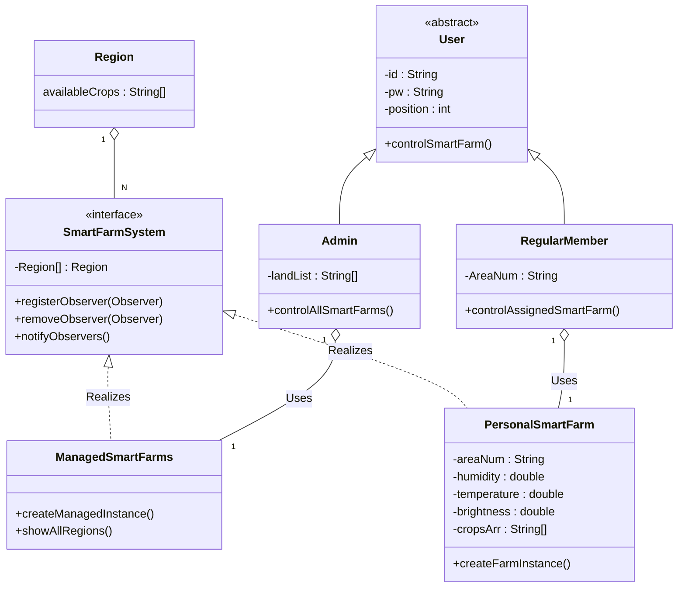

# personal_project_with_arduino_java_react

# Untitled

생성자: 정균민
생성 일시: July 24, 2023 4:10 PM

```mermaid
classDiagram
    class SmartFarmSystem {
				-Region[] : Region
        <<interface>>
        +registerObserver(Observer)
        +removeObserver(Observer)
        +notifyObservers()
    }

    class User {
        <<abstract>>
				-id : String
				-pw : String
				-position : int
        +controlSmartFarm()
    }

    class Admin {
				-landList : String[]
        +controlAllSmartFarms()
    }

    class RegularMember {
				-AreaNum : String
        +controlAssignedSmartFarm()
    }

    class PersonalSmartFarm {
			-areaNum : String
			-humidity : double
			-temperature : double
			-brightness : double
			-cropsArr : String[]
        +createFarmInstance()
    }

    class ManagedSmartFarms {
        +createManagedInstance()
				+showAllRegions()
    }

		class Region {
			availableCrops : String[]
		}

    User <|-- Admin
    User <|-- RegularMember
    SmartFarmSystem <|.. PersonalSmartFarm : Realizes
    SmartFarmSystem <|.. ManagedSmartFarms : Realizes
    Admin "1" o-- "1" ManagedSmartFarms : Uses
    RegularMember "1" o-- "1" PersonalSmartFarm : Uses
		Region "1" o-- "N" SmartFarmSystem 
  
```
